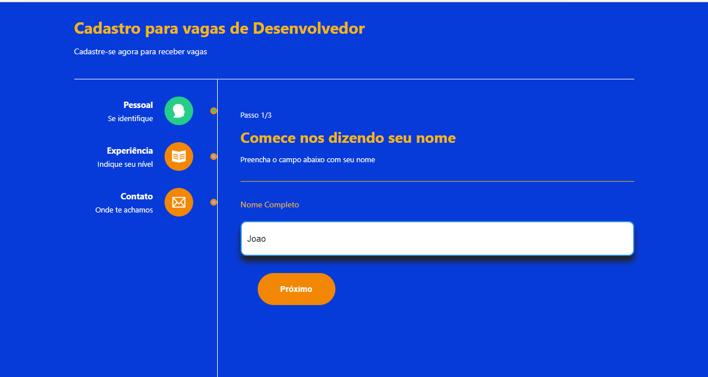

<h1 align='center'>
    <p>Projeto Processo Seletivo</p>
</h1>


##Sobre o Porjeto - 

💻 Projeto desenvolvido com CRA , um formulário multi-etapas com tema Vagas para desenvolvedor

💻 Project developed with CRA , multi-step form with theme Developer Jobs

## Tecnologias usadas ⛏ 

•React.Js

•Styled Components

•router-dom

•React-toastify

•React-icons


## Contribue ♻
```bash
#Clone o projeto - Clone the project
$ git clone
```

```bash
#Install
$ npm install react-toastify
$ npm install styled-components
$ npm install @types/styled-components
$ npm install react-icons
$ npm install react-router-dom
```
<p align='center'> Or</p>

```bash
$ yarn
```

<h1 align='center'>
    <h3>Pré visualização do projeto</h3>
    
</h1>